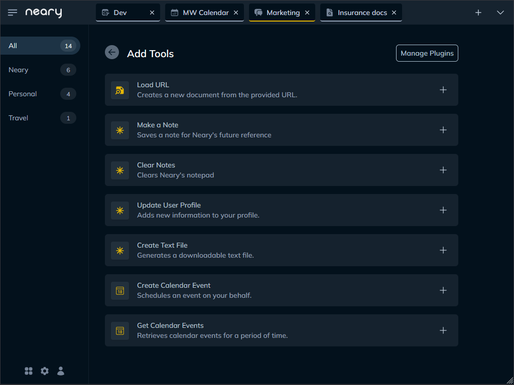

<h1 align="center">
   
  
   
  Neary
   
</h1>

<h4 align="center">An interface designed for LLM powerusers, with a feature-set to match.</h4>

  <a href="#key-features">Key Features</a> •
  <a href="#installation">Installation</a> •
  <a href="docs/user_guide.md">User Guide</a> •
  <a href="#get-involved">Get Involved</a> •
  <a href="#license">License</a>

## Key Features

- ### An Interface For Powerusers
  - Organize conversations into tabs and spaces
  - Manage conversations on the fly with slash commands
  - Embedded file manager for document search
  - App-like experience in iOS and Android through a PWA

- ### A Plugin System With Tentacles 🐙
  - Deeply integrated, with full control over context
    - `Snippets` are bits of context inserted into every conversation
    - `Tools` are actions the AI can take on your behalf
  - Plugins have persistent state, removing context limitations
  - Support for third-party integrations is baked in
  - Writing new plugins is so easy gpt-3.5 can do it!

- ### A Customizable Everything
  - Use the `Chat Stack` to organize your Snippets, Tools and Instructions into a blueprint for your conversation
  - Manage all the chat models settings at the conversation-level
  - Support for OpenAI, Azure and your own custom endpoints
  - Save your favorite configurations as `Presets`
  - Import and export Presets as json files

 

  
  &nbsp;&nbsp;
  
  &nbsp;&nbsp;
  

 

## Installation

### Docker

1. Clone this repository
   
2. Rename `settings.toml.example` to `settings.toml`
   
3. Open `settings.toml` and add your OpenAI API key and/or custom endpoint
   
4. Run `docker compose up --build`
   
5. Point your browser to `http://localhost:8000`

### Manual Installation

1. Clone this repository
   
2. Rename `settings.toml.example` to `settings.toml`
   
3. Open `settings.toml` and add your OpenAI API key and/or custom endpoint

4. Change directory to `/backend`

5. Run `pip install -r requirements.txt`

6. While in `/backend`, run `python main.py`

7. Point your browser to `http://localhost:8000`

### Upgrading

1. Run `git pull` from the project root
   
2. If you're using Docker, rebuild the image
   
3. Restart the app

## User Guide

The [user guide](./docs/user_guide.md) is the best way to get acquainted with Neary. Check it out!

## Get Involved

- [Write a plugin](./docs/write_a_plugin.md)! Plugin development is fun and easy to pickup. When you're ready to share, submit it as a PR.

- Have something else in mind? [Drop me a line](mailto:joe@might.works).

## License

Neary is free to use and open source. It operates under the GPU General Public License.