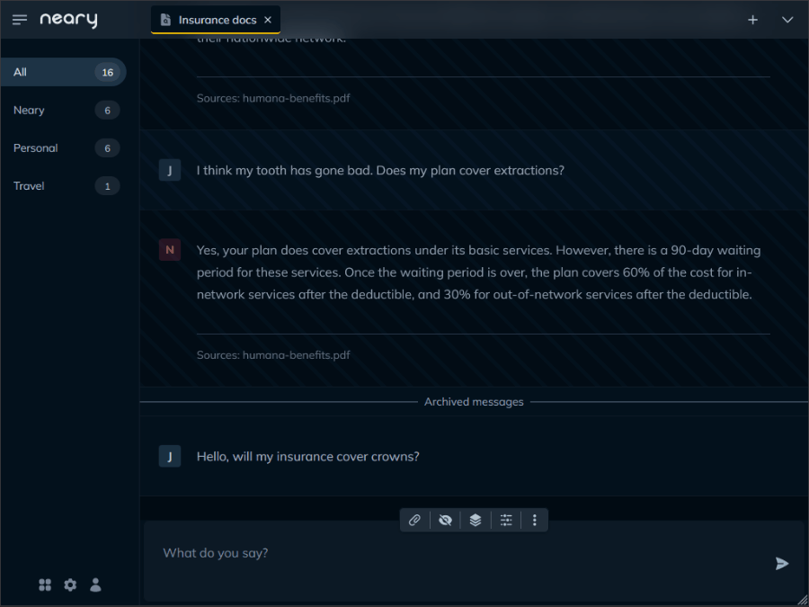
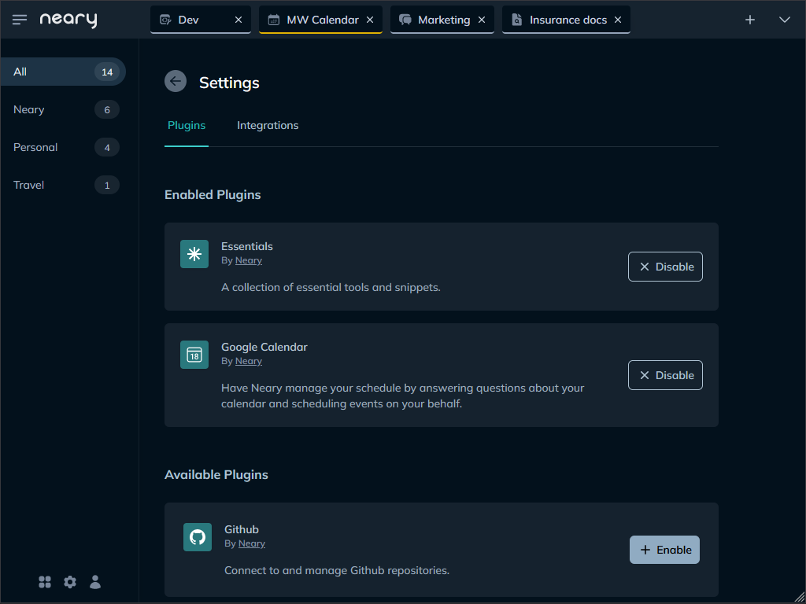
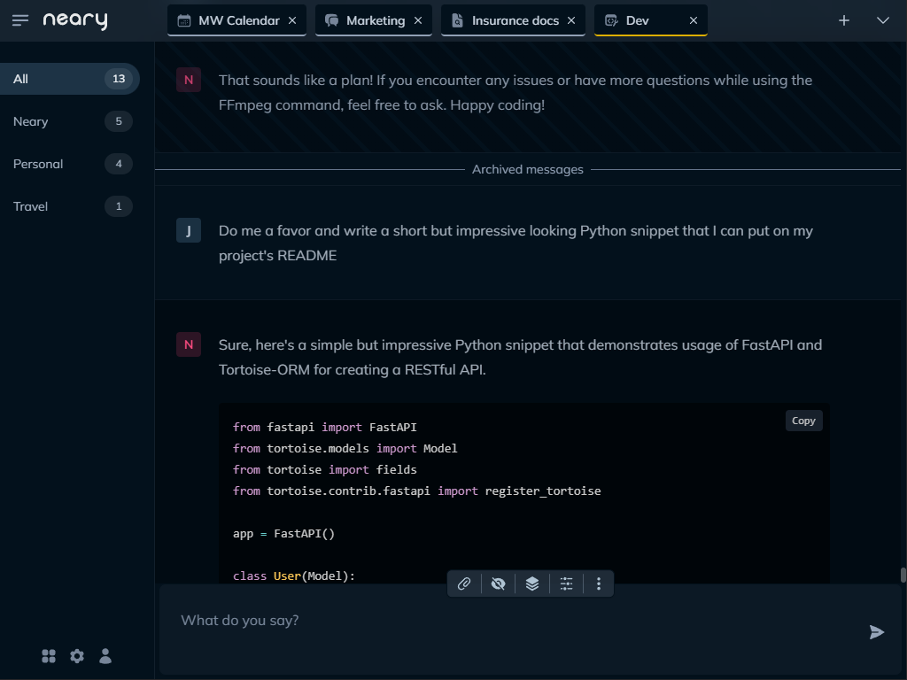
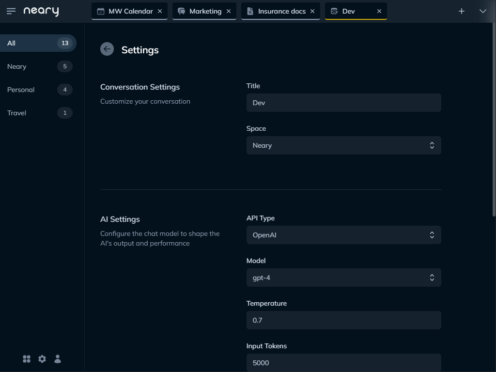

<h1 align="center">
   
  
   
  Neary
   
</h1>

<h4 align="center">An interface designed for LLM powerusers, with a feature-set to match.</h4>

  <a href="#key-features">Key Features</a> •
  <a href="#download">Installation</a> •
  <a href="#credits">User Guide</a> •
  <a href="#credits">Get Involved</a> •
  <a href="#license">License</a>

## Key Features

### An Interface For Powerusers

- Open conversations in tabs for easy access

- Stay organized with spaces, which act as folders for conversations

- Carry multiple, simultaneous conversations thanks to an async design

- Archive messages to reset context without losing your conversation
  
- Manage conversations on the fly with slash commands

- Integrated documents for easy document search
  
- See the conversation *behind* the conversation with X-Ray

- Get an app-like experience on iOS and Android with our PWA

### A Plugin System With Lots of Tentacles 🐙

- Plugins have full control over the context

- *Snippets* and *tools* are bundled together in one thematic package

  - Snippets are pieces of context automatically inserted into the conversation

  - Tools are actions the AI can take on your behalf

- Snippets and tools can be mixed and matched at the conversation level

- Plugins have a persistant state, removing the limitations of context
  
- Support for third-party integrations is baked into the API

- Creating a new plugin is easy. So easy gpt-3.5 can do it!
  

### Powerful Presets, Fully Customizable

- Customize *everything* at the conversation level

  - Support for OpenAI, Azure and your own custom endpoints

  - Choose a model and configure all the common settings

  - Use your Chat Stack to configure plugins and custom instructions

- Use *presets* to start with a recipe

  - Get started with a range of built-in presets

  - Switch presets on the fly, and keep your conversation

  - Choose a default preset to apply to new conversations

- Perfect, save and share your presets

  - Create a custom preset or update an existing preset

  - Export your preset as a file and share with others

  - Import presets others share with you

 

  
  &nbsp;&nbsp;
  
  &nbsp;&nbsp;
  

 

## Installation

### Docker (recommended)

1. Clone this repository
   
2. Rename `settings.toml.example` to `settings.toml`
   
3. Open `settings.toml` and add your OpenAI API key and/or custom endpoint
   
4. Run `docker compose up --build`
   
5. Point your browser to `http://localhost:8000`

### Manual Installation

1. Clone this repository
   
2. Rename `settings.toml.example` to `settings.toml`
   
3. Open `settings.toml` and add your OpenAI API key and/or custom endpoint

4. Change directory to `/backend`

5. Run `pip install -r requirements.txt`

6. While in `/backend`, run `python main.py`

7. Point your browser to `http://localhost:8000`

See the [configuration guide](#) for more details.

### Upgrading

1. Run `git pull` from the project root
   
2. If you're using Docker, rebuild the image
   
3. Restart the app

## User Guide

The [user guide](#) is the best way to get acquainted with Neary. [Check it out](#)!

## Get Involved

- **[Write a plugin](#)**. It's fun and easy. And all contributors get one of these: 🏆. Actually, just take it 🤲🏆. I have a lot. We'll call it a show of good faith.

- **Share your presets**. When you create a custom present in Neary, you can choose to share it with the community. Preset creators were *supposed* to get one of these: 🏆, but prospective plugin contributors took them all.

- Have something else in mind? Drop me line: [joe@might.works](#). But seriously, I'm out of trophies, so please don't ask.

## License

Neary is free to use and open source. It operates under the GPU General Public License.