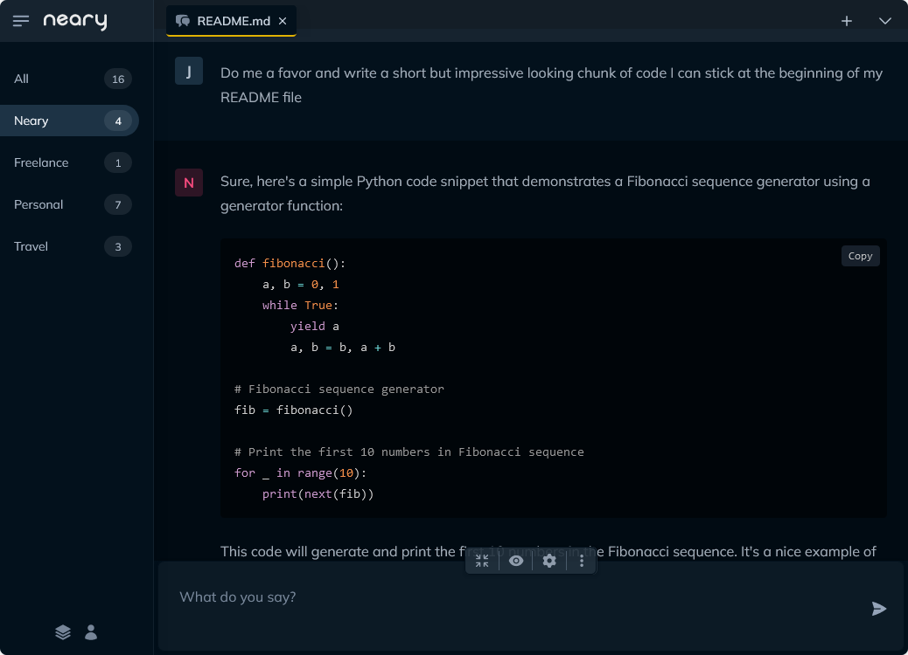
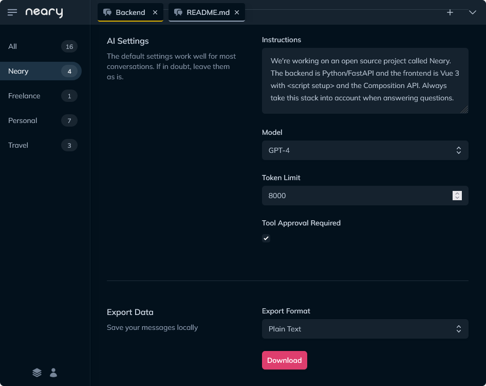
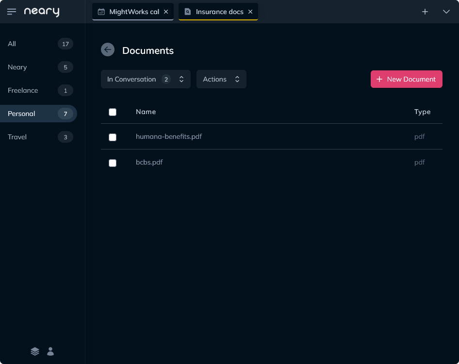
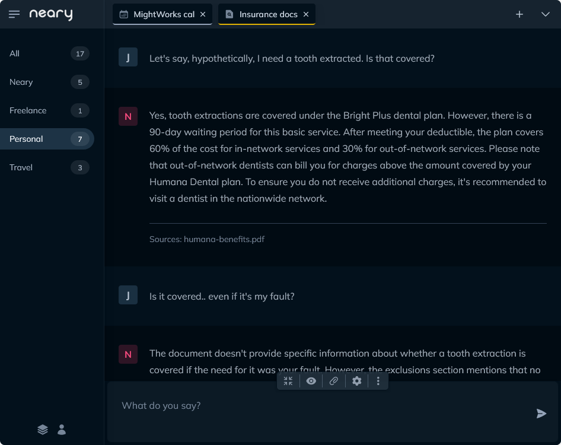
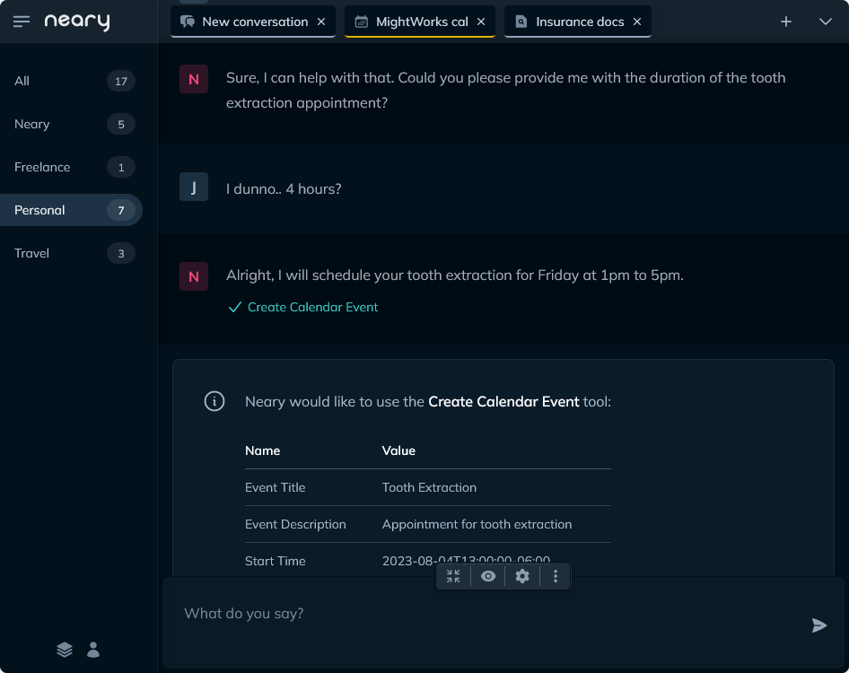

# Neary

Neary is a chat-based app that helps users **get more done** with large language models. It goes a level deeper than ChatGPT and similar interfaces, with an **intuitive UI** for managing conversations across different contexts and a **fresh take** on leveraging tools and third-party integrations.

## Quick start

1. Clone this respository
   
2. Add your OpenAI API key to the .env file in the project root
   
3. Run `docker compose up` in the project root
   
4. Point your browser to http://localhost

For more options, check out the [full installation guide](#installation-guide).

## Features

### A UI for Power Users

- Conversations can be organized into spaces (like folders for conversations) and then easily filtered, providing a simple way to **manage conversations across different contexts**.
  
- Conversations can be opened in tabs for **quick switching**.
  
- Carry multiple conversations at once, with support for **simutaneous incoming streaming messages**, thanks to async design.

- A broad range of conversation-level settings make each conversation **fully customizable**.

- Archive messages to start with a fresh context, **without losing your conversation** (or messages).

- Designed for desktop and mobile, with an **integrated PWA** for an app-like experience on iOS and Android.

#### Other Goodies

- Slash commands for creating, archiving and deleting conversations
  
- Toggle on and off archived messages with one click
 
- Start incoming messages at the top of the window with "room to grow" mode

- Click-to-copy in code blocks and select-to-copy everywhere

 

  
  &nbsp;&nbsp;
  

 

### Supercharge Conversations with Programs

Programs can be added to conversations to enhance them with special functionality. Programs offer a deeper level of integration than ChatGPT's plugins or tools alone. They can include:

1. Customized model settings that change the way the AI behaves

2. A set of tools that give the AI special abilities

3. Custom functionality that shapes the conversation

4. A custom presentation layer

Neary currently has three built-in Programs, which are still fairly shallow in scope and *mostly* serve as a proof-of-concept.

#### **Document Chat**

Allows users to "chat" with their documents. Text files (plain-text and pdf) and content from websites can be added to the conversation, and then you can ask the AI questions about them. It's like having a smart friend who does the assigned reading and then gives you the answers you need.

 

&nbsp;

&nbsp;

#### **Calendar Chat**

Thanks to a Google Calendar API integration, users can ask questions about their schedule and have the AI schedule events on their behalf. Gmail integration and a true "executive assistant" experience is coming soon.

Note: This program requires Google OAuth credentials to setup, [see here](docs/calendar_chat.md) for the step-by-step.

 

#### **Support**

This program runs when Neary first starts. It's purpose is to on-board the user by setting up their profile and answering questions about the app.

*All programs operate on a **zero trust** principle. We never allow the AI to invoke real-world actions that could be undesirable. You'll always be prompted for approval first.*

### About Your Data

- Conversations are all stored locally

- Conversations can be exported in plain-text or JSON

- No telemetry or other gotchas

Note: Messages are sent to OpenAI via the API, but aren't used for training. Read more on OpenAI's policies [here](https://help.openai.com/en/articles/5722486-how-your-data-is-used-to-improve-model-performance).

## Installation Guide

### Docker (recommended)

1. Clone this respository
   
2. Add your OpenAI API key to the .env file in the project root
   
3. Run `docker compose up` in the project root
   
4. Point your browser to http://localhost

### Manual installation

1. Clone this respository
  
2. Set your OpenAI API key: `export OPENAI_API_KEY=your-key-here`
   
3. Run `pip install -r requirements.txt` in /backend

4. Start the backend with `python main.py`
   
5. Run `npm install` in /frontend
   
6. Start the frontend with `npm run dev`
   
7. Point your browser to http://localhost:3000

## Usage

- Complete guide coming soon!

## Feedback

Problems? Ideas? Want to get involved? Feel free to open an issue, start a discussion, or drop me a line at joe@might.works.

## License

Neary is free to use and open source. It operates under the GPU General Public License.