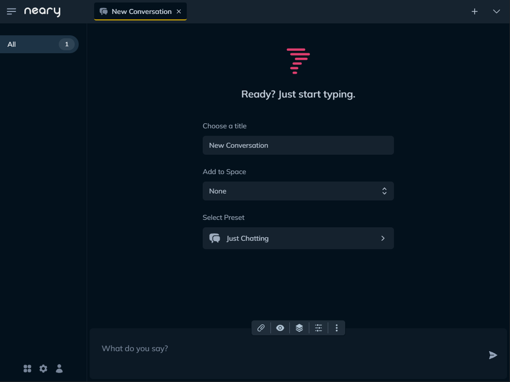

<h1 align="center">
   
  
   
  User Guide
   
</h1>

Ready to get cozy with Neary? Follow along as you setup your Neary account to get full acquainted.

## Configuration & Installation

First things first, install Neary using your preferred [installation option](../README.md#installation). For the purposes of this guide, we'll assume you're using the default setup, with Neary available at http://localhost:8000.

Make sure you edit `settings.toml` to include your OpenAI key and/or custom endpoint, and add your credentials for any third-party integrations you want to use under the `[integrations]` section.

Once you've started Neary, head to http://localhost:8000 to create an account.

> [!NOTE]
> Authentication is enabled by default. If you'd like to disable it altogether, set `enable_auth` to false in `settings.toml`.

The first time you load Neary you'll be greeted with a screen asking you to register with an email and a password. Enter whatever you'd like. This information is only used for authentication purposes.

## Setup Your Space

And you're in! You'll be welcomed with a screen that looks like this:

Before you get to typing (you'll have plenty of time for that, trust me), let's do a bit of setup.

### Creating a User Profile

Click the  icon at the bottom of the sidebar. This will take you to your Account Settings, and the first thing you'll see is your user profile.

You don't *have* to fill out your profile, but it's a good idea. Information you add to your profile will automatically be added to context in any conversation where the `Insert User Profile` snippet is active.

We recommend adding at least your name and location to start. You can always add new items to your profile later.

> [!NOTE]
> If you have the 'Update User Profile' tool enabled in your conversation, just ask and Neary will update your profile for you!

Excellent. Now Neary knows who you are. Or who you purport to be.

### Create a New Space (or Two)

Spaces in Neary are like folders for your conversations. They help you stay organized and find what you're looking for more quickly. Click the  icon to access your spaces. You can add, edit and remove spaces at any time.

You can add a conversation to a space simply by making sure the space is selected when you create a new conversation, and you can always change the space a conversation is assigned to.

## Let's Talk About Conversations

Conversations are core to Neary. They're also **super customizable** and **highly modular**. This is the best way to take advantage of the wide range of use cases that LLMs unlock for us.

Let's take a spin through a fresh conversation to see what makes them tick. New conversations can be created in three ways:

1. Click the `New Conversation` button in any empty space
2. Click the `+` icon in the nav bar
3. Use the `/new` slash command

After you create a new conversation, you'll be greeted with an "empty state" that includes fields to set the title, space and preset for your conversation.

### Conversation Presets

Presets are essentially pre-packaged "recipes" that imbue your conversation with certain super powers. To illustrate this, let's look at a couple of presets Neary ships with out-of-the-box:

- `Just Chatting` turns the AI into a friendly conversation partner capable of tailoring responses to your profile and remembering important tidbits, regardless of context.

- `Calendar Chat` turns the AI into a personal assistant, capable of retreiving events on your Google Calendar, scheduling events on your behalf, and brainstorming reasons why you can't make a meeting you'd rather miss.

- `Document Chat` turns the AI into a smart friend who is happy to read documents and webpages on your behalf, and then answer all of your questions.

We'll get into *how* this happens in a moment, but for now just remember you can radically change the nature and function of any conversation simply by selecting a new preset.

### The Chat Stack

To see what makes a conversation tick, let's first checkout the **Chat Stack**. After your create a new conversation, click through on the current preset, or click the "stacks" ()  icon in the toolbar to view that conversation's chat stack.

The chat stack essentially constructs the **flow** of your conversation. In order of their appearance:

- Changing the `Preset` will load a new set of instructions, snippets and tools into the conversation.

- The `Instructions`, or system message, you set the "tone" for the conversation. For more in-depth examples, check out the different presets and see how varied instructions can be.

- `Snippets` are pieces of context that are automatically injected into the conversation behind the scenes. For example, you can enable the `Insert User Profile` snippet to ensure the AI is aware of the information in your profile when its responding.

- `Tools` are actions the AI is allowed to take on your behalf. The AI "chooses" which tool to use, if any, based on the chat context. For example, the `Update User Profile` tool allows the AI to update your profile information for you, right in the chat.

And this is where it gets *really fun*. You can mix and match snippets and tools to create your perfect conversation. And, when you've done it, you can save your custom Chat Stack as as a preset for easy access.

Snippets and Tools are packaged together in Plugins, but we'll get to that in a moment. For now, let's explore the second set of knobs you have for customizing conversations.

> [!WARNING]
> When it comes to LLMs, context is king. Packing a conversation with unrelated snippets and tools will not only result in worse performance, it'll cost you more money! Instead, create several narrowly focused conversations and switch between them as necessary.

## AI Settings

The other of a conversation's "anatomy" is the AI, or chat model settings. To access these, click the "gear" ()

While we're on the the topic of slash commands..

#### Other Slash Commands You Should Know

- `/new` creates a new conversation
- `/title [some title]` sets a conversation's title
- `/archive` archives messages in a conversation
- `/delete` deletes a conversation