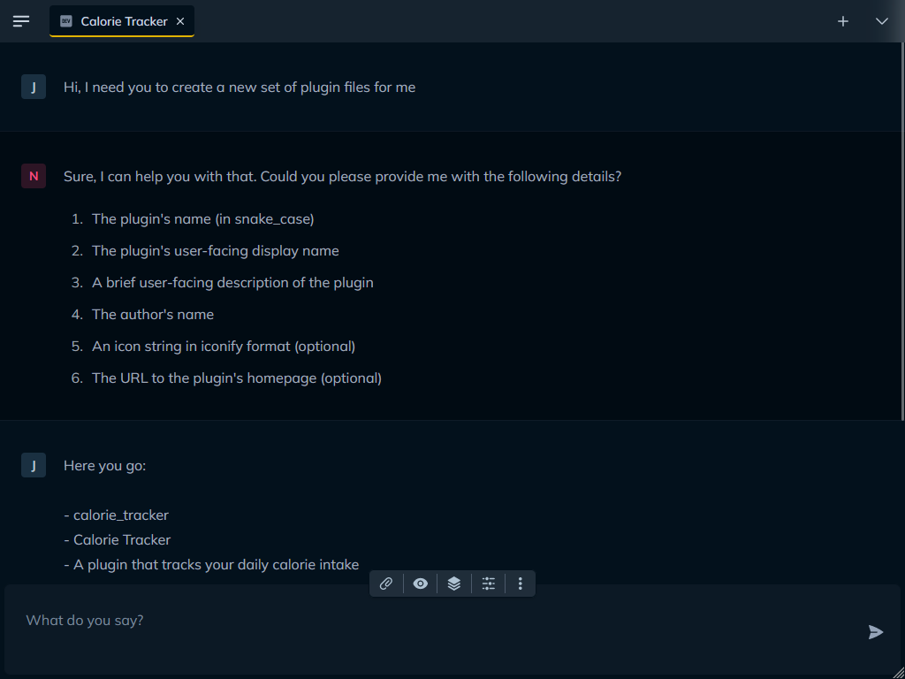
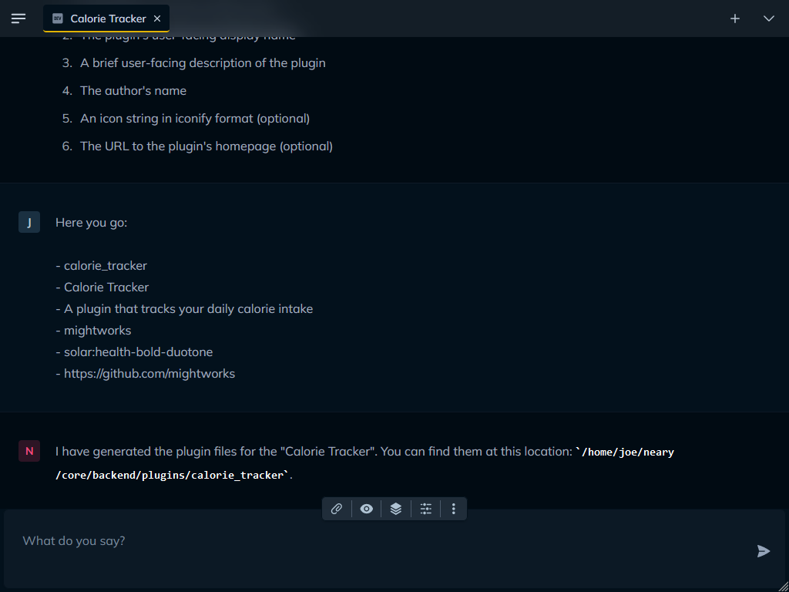

# Plugin Development

We've designed Neary to allow for plugins to deeply integrate into conversations, providing for high-levels of customization and creating a platform for powerful new LLM applications.

In this guide, we'll take a practical approach to plugin development, introducing key concepts and illustrating them by building a new plugin from the ground up.

## The Structure of a Plugin

In Neary, plugins hook into the message-response loop, which means they have the ability to alter the message context as it's being assembled, guide the responses from the LLM, and then start the process all over again.

Plugins accomplish this by implementing two different types of functions:

- `Snippets` are bits of context that are automatically inserted into every conversation, which inform the LLM's response.
  
- `Tools` are actions the AI can take in response to the context it was given. Tools are inherently powerful, because they allow the LLM to respond in ways that go beyond a traditional text message response.

At its most fundamental level, **a plugin bundles together complementary snippets and tools.**

>[!NOTE]  
>Although a plugin's snippets and tools are frequently used alongside each other in a conversation, they don't *have to be*. They're decoupled by design.

### An Simple Example

To illustrate, let's look at a snippet and tool from the `Essentials` plugin:

```python
    class Essentials(BasePlugin):
        def __init__(self, id, conversation, settings=None, data=None):
            super().__init__(id, conversation, settings, data)

            if 'notepad' not in self.data:
                self.data['notepad'] = []

        @tool
        async def make_a_note(self, text: str):
            """ Save a note to Neary's notepad"""
            if text:
                self.data['notepad'].append(text)
                await self.save_state()
            return "Your note has been saved!"

        @snippet
        async def insert_notes(self, context):
            """ Insert Neary's notepad into context """
            if len(self.data['notepad']) > 0 :
                notes_str = "The following is your notepad. These are helpful notes you left for yourself. Refer to these as needed:\n\n"
                for note in self.data['notepad']:
                    notes_str += f"- {note}\n\n"
                context.add_snippet(notes_str)
            else:
                context.add_snippet("Your notepad is empty!")

```

With the `make_a_note` tool, we give the LLM the ability to save a note to memory. Then, with the `insert_notes` snippet, we automatically inject those notes into the message context.

Ultimately, this gives the LLM the ability to "remember" important tidbits that will persist beyond the current context window.

You may have also noticed that the content of the notepad is stored in `self.data['notepad']`. This highlights one of the big advantages of bundling related tools and snippets together: It's really easy to share settings and data between functions.

## Let's Build a Plugin

I'm going to take this opportunity to build a plugin I've been wanting for a while. You see, I've just turned 40, and my propensity to eat like a child has put me at grave risk of becoming overweight.

Methodically counting calories sounds only slightly better than getting fat, so I'd like to build a plugin that will allow the AI to do that for me.

We'll call our plugin.. get ready for it.. **Calorie Tracker**!

>[!NOTE]  
> If you want to contribute your plugin to the community (and you should!), fork the Neary repo so you can easily submit a PR when it's ready to go.

### Using the Plugin Assistant

Neary ships with a `Neary Developer Tools` plugin that contains a set of tools to help streamline the plugin development process. Even if you know what you're doing, it'll save you a bunch of time.

To use it, create a new conversation and select the `Plugin Assistant` preset. Your Chat Stack will now contain three new tools: `Generate Plugin Files`, `Generate Snippet` and `Generate Tool`.

We'll ask our assistant to generate files for our new plugin using the `Generate Plugin Files` tool. Once we've provided it with all the info it needs, it will create our plugin in the appropriate directory:

<br/>

<div align="center">
  
  &nbsp;&nbsp;
  
</div>

<br/>

Our newly created plugin directory contains two files: `calorie_tracker.py` and `plugin.toml`.

Note that:

- All plugins live in their own folder in the `backend/plugins` directory, e.g. `backend/plugins/my_plugin`
- The folder name is considered the canonical name for your plugin
- Inside your folder, you'll always have (at least) two files
  - `plugin.toml`, which contains the configuration information for your plugin
  - `my_plugin.py`, which contains your plugin class and functions

>[!IMPORTANT]  
>Your .py filename should always match the name of your plugin folder

### The Plugin Class

Let's open the plugin module and take a look at the code:

```python
from backend.plugins import BasePlugin, snippet, tool


class CalorieTracker(BasePlugin):
    def __init__(self, id, conversation, settings=None, data=None):
        super().__init__(id, conversation, settings, data)

    @snippet
    async def example_snippet(self, context):
        context.add_snippet("Snippet text goes here")

    @tool
    async def example_tool(self, arg1: int, arg2: int = 0) -> str:
        tool_output = arg1 + arg2
        return f"{arg1} + {arg2} is {tool_output}!"
```

Our plugin class, `CalorieTracker`, subclasses `BasePlugin` and takes four parameters:

- `id` is the unique identifier for the plugin instance
- `conversation` is the `Conversation` object where the plugin is being used
- `settings` and `data` are, as you may have guessed, settings and data associated with the plugin instance

The included examples, while simplistic, highlight a couple of important pieces of information:

- Snippets are decorated with `@snippet`. The only argument they take, apart from `self`, is `context`. `context` is a `MessageChain` object that contains the entirety of the conversation context. It's passed to every snippet upon instantiation. New text snippets can be added to the context with `context.add_snippet()`.

- Tools are decorated with `@tool`. Each tool, unlike snippets, require their own set of parameters. These are the arguments that are passed in by the LLM when the tool is executed. Tool output is returned as a string directly from the function.

#### Plugin State, Settings & Data

Each plugin has its own persistent state, and this state is made up of two attributes, `settings` and `data`:

- All of a plugin's settings are available in the `self.settings` dict. Settings are always stored at the function-level, using the function name as a key. For example, settings for a tool named `example_tool` would be available at `self.settings['example_tool']`.

- Each plugin has its own unstructured key-value store available in the `self.data` attribute. This variable is initalized as an empty dict and can be used in any way we see fit. This is useful for maintaining internal data or state variables that shouldn't be exposed as settings.

Whenever a plugin's settings or data is updated, `await self.save_state()` must be called to persist the changes to the database.

We'll cover more examples of how to use a plugin's settings and data shortly. For now, let's take a look at the second half of a plugin, the config file.

### The Plugin Config

When we open the `plugin.toml` file, the first thing we see is the plugin's metadata:

```toml
[metadata]
display_name = "Calorie Tracker"
description = "A plugin that tracks your daily calorie intake"
icon = "solar:health-bold-duotone"
version = "0.1.0"
author = "mightworks"
url = "https://github.com/mightworks"

# When you're ready to test, set `live` to `true` or simply remove this line
live = false
```

The metadata should look familiar; it's the info we fed the Plugin Assistant when our plugin files were created. A plugin's metadata can be updated at any time and the changes will be reflected in Neary on app restart.

Next, we see a configuration entry for the example snippet that was baked into our `calorie_tracker.py` file:

```toml
# Snippet: Example Snippet

[snippets.example_snippet]
display_name = "Example Snippet"
description = "User-facing snippet description"
```

>[!IMPORTANT]  
>Every tool and snippet in the plugin module should have a corresponding entry in the configuration file

This config entry is as simple as it gets. It defines a `display_name` and a `description` for the snippet under the appropriate header (`[snippets.example_snippet]`). These values are used to present the snippet to the user on the frontend.

Next up is the entry for our tool, which has a bit more meat to it:

```toml
# Tool: Example Tool

[tools.example_tool]
display_name = "Example Tool"
description = "User-facing tool description"
llm_description = "LLM-facing tool description"

# Example Tool -> Parameters

[tools.example_tool.parameters.arg1]
type = "integer"
description = "The first number to add"
required = true

[tools.example_tool.parameters.arg2]
type = "integer"
description = "The second number to add"
required = false

# Example Tool -> Settings

[tools.example_tool.settings.requires_approval]
description = "Require user approval before running tool"
value = false
type = "boolean"
editable = true

[tools.example_tool.settings.follow_up_on_output]
description = "Generate a new response to tool output"
value = true
type = "boolean"
editable = false
```

You'll notice a number of differences about this entry:

- There's a new key, `llm_description`, in the metadata. This is the description that the LLM will use to decide whether or not to call the function. It often differs from the user-facing description.

- The tool has a new `parameters` key. This is a dictionary that defines what arguments the tool's function takes, along with an llm-facing description for each parameter, an expected type, and a boolean indicating whether or not the parameter is required. Parameter definitions are bundled up and sent to the LLM with your request, allowing the LLM to return a function call with its response.

- The tool also has a `settings` key. This is a dictionary that defines what settings the tool has available, along with their expected type, default value and a boolean indicating whether or not they should be editable by the user on the frontend. All of this information is used to populate the plugin settings in the UI.

These parameters and settings map back to our plugin class. Each parameter in our tool function must have an entry here, and each setting is accessible from the key with the same name in our `self.settings` dictionary.


>[!IMPORTANT]  
>Every tool must have at least two settings defined: `requires_approval`, which determines whether or not the user needs to approve the tool usage, and `follow_up_on_output`, which determines whether or not the tool output should be passed back to the LLM for an additonal response.
>
> Snippets can have their own settings, but none are required.

The boilerplate associated with settings and parameters, while necessary, isn't particulary fun to write. Fortunately, our Plugin Assistant can help with this too.

### Generating Our Tools & Snippets

First, let's decide what we want our Calorie Tracker plugin to do. At a minimum, we should be able to:

- Set a daily calorie target

- Record food and calories consumed throughout the day

- Get an up-to-date tally on how many calories we have left in our "budget"

We'll accomplish those things with two tools and one snippet.

#### Tool 1: Set Calorie Target

When we ask the Plugin Assistant to create a new tool for us called `Set Calorie Target`, we get back this config entry:

```toml
# Tool: Set Calorie Target

[tools.set_calorie_target]
display_name = "Set Calorie Target"
description = "Allows the user to set their desired daily calorie intake."
llm_description = "Use this tool when the user wants to define or update their daily calorie intake goal."

[tools.set_calorie_target.parameters.calorie_target]
type = "integer"
description = "The desired daily calorie intake as an integer."
required = true

[tools.set_calorie_target.settings.calorie_target]
description = "The user's desired daily calorie intake."
type = "integer"
editable = true

[tools.set_calorie_target.settings.requires_approval]
description = "Require user approval before running tool"
value = true
type = "boolean"
editable = true

[tools.set_calorie_target.settings.follow_up_on_output]
description = "Generate a new response to tool output"
value = true
type = "boolean"
editable = false
```

As well as this function template:

```python
    @tool
    async def set_calorie_target(self,
        calorie_target: int):
        """
        Allows the user to set their desired daily calorie intake.
        """

        # Your tool logic here
        output = "..."

        # Return tool output as a string
        return output
```

This looks good! Our tool takes a single parameter, `calorie_target`, and a setting was defined in our config with the same name. This is where we'll store the value of the calorie target when set by the user or LLM.

Now let's implement the logic of our `set_calorie_target` function:

```python
    @tool
    async def set_calorie_target(self,
        calorie_target: int):
        """
        Allows the user to set their desired daily calorie intake.
        """

        if calorie_target >= 0:
            # Save the user's calorie target in our settings key
            self.settings['set_calorie_target']['calorie_target'] = calorie_target
            await self.save_state()
            return f"Calorie target set to {calorie_target}"
        else:
            return "The user can't eat negative calories a day!"
```

Let's quickly look at the two other settings in our config, `requires_approval` and `follow_up_on_output`. These were automatically generated for us because they're required entries for every tool.

`requires_approval` defaults to `true`. This means the user will be prompted before the tool request is executed. In this case, the LLM just needs to pass in our calorie target. It's tough to screw up. And if it does, we can easily fix it. So we'll set this value to `false`.

`follow_up_on_output` is also set to `true`. While not technically necessary, it will add continuity to the conversation to have the LLM follow-up once the tool is successfully executed. So we'll leave this as is.

Now that we've completed our `set_calorie_target` tool, let's clear out the examples from our `plugin.toml` and `calorie_tracker.py` files and add in our new code.

Our `plugin.toml` file now looks like this:

```toml
[metadata]
display_name = "Calorie Tracker"
description = "A plugin that tracks your daily calorie intake"
icon = "solar:health-bold-duotone"
version = "0.1.0"
author = "mightworks"
url = "https://github.com/mightworks"

# When you're ready to test, set `live` to `true` or simply remove this line
live = false

# Tool: Set Calorie Target

[tools.set_calorie_target]
display_name = "Set Calorie Target"
description = "Allows the user to set their desired daily calorie intake."
llm_description = "Use this tool when the user wants to define or update their daily calorie intake goal."

[tools.set_calorie_target.parameters.calorie_target]
type = "integer"
description = "The desired daily calorie intake as an integer."
required = true

[tools.set_calorie_target.settings.calorie_target]
description = "The user's desired daily calorie intake."
type = "integer"
editable = true

[tools.set_calorie_target.settings.requires_approval]
description = "Require user approval before running tool"
value = false
type = "boolean"
editable = true

[tools.set_calorie_target.settings.follow_up_on_output]
description = "Generate a new response to tool output"
value = true
type = "boolean"
editable = false
```

and our `calorie_tracker.py` file looks like this:

```python
from backend.plugins import BasePlugin, snippet, tool

class CalorieTracker(BasePlugin):
    def __init__(self, id, conversation, settings=None, data=None):
        super().__init__(id, conversation, settings, data)

    @tool
    async def set_calorie_target(self,
        calorie_target: int):
        """
        Allows the user to set their desired daily calorie intake.
        """

        if calorie_target > 0:
            # Save the user's calorie target in this tool's settings key
            self.settings['set_calorie_target']['calorie_target'] = calorie_target
            await self.save_state()
            return f"Calorie target set to {calorie_target}"
        else:
            return "The user can't eat negative calories a day!"
```

### Tool 2: Log Calories

Our plugin will technically load and run as is, but it isn't particularly useful yet. Next lets add a tool called `Log Calories`. This is how we'll track calorie intake over time.

We shouldn't need any custom settings for this tool, but we will need to make sure we have definitions for the required parameters which should include the food we ate, calories consumed, and the time of the event.

Here's what we get back from our Plugin Assistant:

```toml
# Tool: Log Calories

[tools.log_calories]
display_name = "Log Calories"
description = "Records the food, amount of calories, and time when the user consumed them."
llm_description = "Use this tool when the user wants to log a meal or snack in their calorie tracker."

[tools.log_calories.parameters.food]
type = "string"
description = "The food item consumed."
required = true

[tools.log_calories.parameters.calories]
type = "integer"
description = "The number of calories in the food item."
required = true

[tools.log_calories.parameters.time]
type = "string"
description = "The time the food item was consumed as an ISO string."
required = true

[tools.log_calories.settings.requires_approval]
description = "Require user approval before running tool"
value = true
type = "boolean"
editable = true

[tools.log_calories.settings.follow_up_on_output]
description = "Generate a new response to tool output"
value = true
type = "boolean"
editable = false
```

```python
    @tool
    async def log_calories(self,
        food: str,
        calories: int,
        time: str):
        """
        Records the food, amount of calories, and time when the user consumed them.
        """

        # Your tool logic here
        output = "..."

        # Return tool output as a string
        return output
```

After we add the config and function to our `plugin.toml` and `calorie_tracker.py` files, respectively, we'll make a couple of edits to the config:

- We'll modify our `llm_description` to note that the LLM should ballpark the calories if not provided by the user. We want to be lazy about this, after all!

- The `time` parameter should be optional, and in our function we'll just use the current time if none is specified. So here, we'll set `required` to `false`.

Now let's implement our tool function:

```python
    @tool
    async def create_calorie_log_entry(self,
        food: str,
        calories: int,
        time: Optional[str] = None):
        """
        Records the food, amount of calories, and time when the user consumed them.
        """

        # If no time was specified, use the current time
        if time is None:
            from datetime import datetime
            time = datetime.now().isoformat()

        log_entry = {
            'food': food,
            'calories': calories,
            'time': time
        }

        # Store the calorie entry in our data dict
        if 'calorie_log' not in self.data:
            self.data['calorie_log'] = []

        self.data['calorie_log'].append(log_entry)

        await self.save_state()

        return "Calorie log entry created!"
```

Now we're getting somewhere. But we're still missing one last piece before we have MVP (Minimum Viable Plugin). We need to make the LLM aware of our calorie target and calories consumed, otherwise it won't be able to help us.

### Snippet: Insert Daily Calories

To do that, we'll create a new snippet called `Insert Daily Calories`. It'll add a short tidbit about our current calorie intake to the conversation context automatically. That way, the information will always be on hand.

Here's what we get back from our Plugin Assistant:

```toml
# Snippet: Insert Daily Calories

[snippets.insert_daily_calories]
display_name = "Insert Daily Calories"
description = "Inserts today's calories consumed."
```

```python
    @snippet
    async def insert_daily_calories(self, context):
        """
        Inserts the current number of calories consumed by the user that day, along with their daily intake target, and how many calories they have left in their 'budget'.
        """

        # Your snippet logic here
        output = "..."

        # Add your output string to context
        context.add_snippet(output)
```

Now let's add these to their respective files and implement the function:

```python
    @snippet
    async def insert_daily_calories(self, context):
        """
        Inserts the current number of calories consumed by the user that day, along with their daily intake target, and how many calories they have left in their 'budget'.
        """
        # Load our calorie log from our data dictionary
        calorie_log = self.data.get('calorie_log', [])
        
        # Get today's calories total
        calories_today = 0
        for log in calorie_log:
            log_date = datetime.strptime(log['time'], '%Y-%m-%dT%H:%M:%S+0000').date()
            if log_date == datetime.date.today():
                calories_today += log['calories']

        # Get our calorie target from the `set_calorie_target` settings key
        calorie_target = self.settings['set_calorie_target']['calorie_target']

        # Calculate calories remaining
        calories_remaining = calorie_target - calories_today

        # Add our snippet to context
        output = f"The user has consumed {calories_today} calories today. Their daily calorie target is {calorie_target}, so they have {calories_remaining} calories left to eat today."

        context.add_snippet(output)
```

And that's it! All we need to do is change the `live` flag to `true` to in our `plugin.toml` file. Then we can enable the plugin and add our new tools and snippet to our Chat Stack to begin using our Calorie Tracking Assistant (or whatever we want to call it!)

In the next section, we'll improve on our plugin by exploring the Services API, which will include:

- Sending messages and alerts directly to the UI
- Getting and setting values in the user's profile
- Accessing credentials for third-party integrations
- Working with files

That section is coming soon. Stay tuned!
